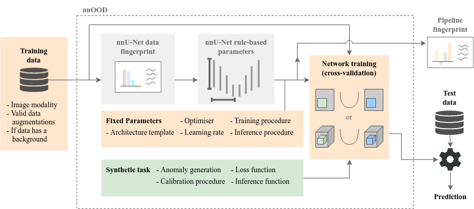

# nnOOD: A Framework for Benchmarking Self-supervised Anomaly Localisation Methods

Recently there have been a number of anomaly detection methods that introduce synthetic anomalies into otherwise healthy
data.
The aim of these methods is to generalise to real, unseen anomalies.
nnOOD is able to compare these methods under a standardised training regime, based on
[nnU-Net](https://github.com/MIC-DKFZ/nnUNet/), where each model is trained to an equal level
of saturation (each can perform the selected synthetic task similarly well).

To facilitate future task development, we also provide a compartmentalised framework for
constructing tasks based on blending patches (the current state-of-the-art), to facilitate further
investigation into this area.

Got any feedback on this project or ideas on how to make it more useful?
I'd love to hear them!
[Open an issue](https://github.com/matt-baugh/nnOOD/issues) and we can talk it through :).



*Overview of the nnOOD framework. The green components are entirely new to nnOOD, orange components differ
significantly from their nnU-Net counterparts and grey components have only minor changes.*

## Installation

 1. Install [PyTorch](https://pytorch.org/get-started/locally/), making sure that you use a version which works with
your hardware.
 2. Install nnOOD using
    ```bash
    git clone https://github.com/matt-baugh/nnOOD
    cd nnOOD
    pip install -e .
    ```

Once installed follow the [experiment walkthrough](documentation/experiment_walkthrough.md) to run nnOOD.

## Summary of main entrypoints:

Full details on how to use these entrypoints to run an experiment are available in
[documentation/experiment_walkthrough.md](documentation/experiment_walkthrough.md).

 - [nnood/experiment_planning/nnOOD_plan_and_preprocess.py](nnood/experiment_planning/nnOOD_plan_and_preprocess.py)
   - Given a dataset in the correct format, plan the experiment + model configuration, and optionally prepare the data.
   - Dataset should be within folder named in environment variable `nnood_raw_data_base` (see [nnood/paths.py](nnood/paths.py))
 - [nnood/training/nnOOD_run_training.py](nnood/training/nnOOD_run_training.py)
   - Train a model on a given dataset using a given self-supervised task.
   - Must have already run nnOOD_plan_and_preprocess for dataset.
   - Self-supervised task must be the name of class within `nnood/self_supervised_task`, which extends and implements
     the interface of [nnood/self_supervised_task/self_sup_task.py](nnood/self_supervised_task/self_sup_task.py)
 - [nnood/evaluation/nnOOD_run_testing.py](nnood/evaluation/nnOOD_run_testing.py)
   - Predict and evaluate a model, trained on a specified self-supervised task, on the datasets test set.
   - Test set is defined as images in `$nnood_raw_data_base/DATASET_NAME/imagesTs`
   - Labels are in `$nnood_raw_data_base/DATASET_NAME/labelsTs` . If there is no label present for a sample, we assume
     it to be normal, so assign a label of all zeroes.

## Existing self-supervised tasks
 - [Foreign Patch Interpolation](https://www.melba-journal.org/papers/2022:013.html)
 - [CutPaste](https://openaccess.thecvf.com/content/CVPR2021/html/Li_CutPaste_Self-Supervised_Learning_for_Anomaly_Detection_and_Localization_CVPR_2021_paper.html)
 - [Poisson Image Interpolation](https://link.springer.com/content/pdf/10.1007%2F978-3-030-87240-3_56.pdf)
 - [Natural Synthetic Anomalies](https://arxiv.org/abs/2109.15222) (both source and mixed gradient variants).

Full details on how to implement your own self-supervised tasks, either from scratch or using the modular components for
making a patch-blending based task, are available in 
[documentation/synthetic_task_guide.md](documentation/synthetic_task_guide.md).

## Notebooks

To test or demo components of nnOOD, use the notebooks within `notebooks`, described in [notebooks/readme.md](notebooks/readme.md).